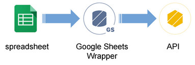
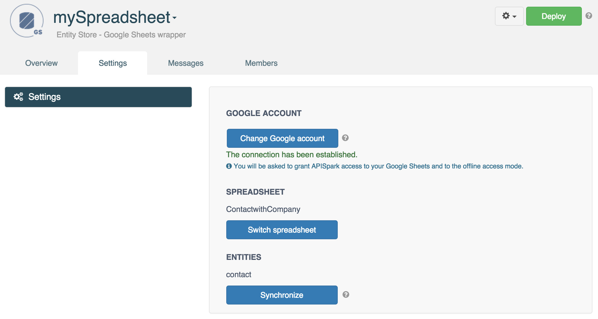
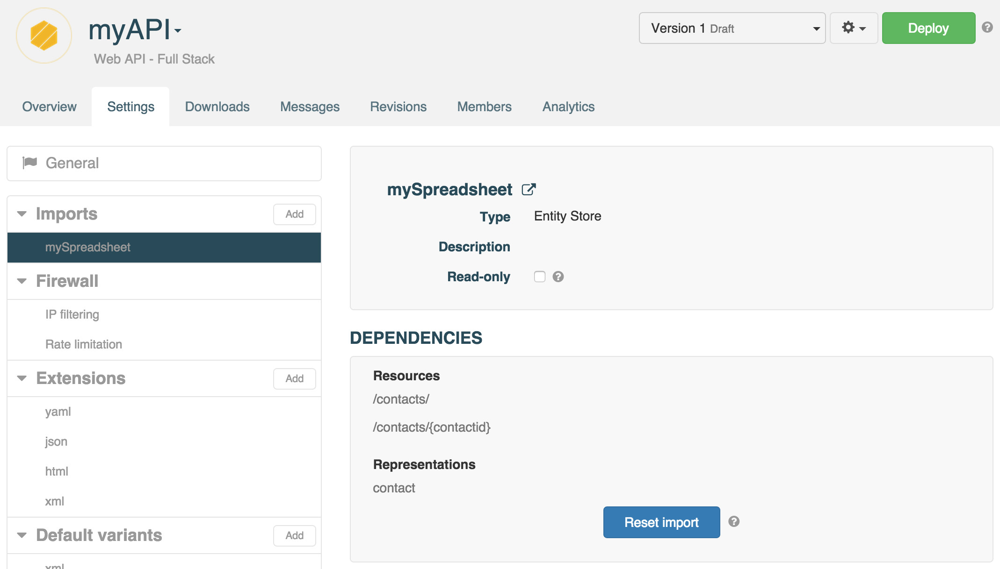

# Introduction

APISpark features a Wrapper Entity Store for Google Sheets spreadsheets. The Google Sheets Wrapper lets you expose data stored in a spreadsheet through a web API. The Google Sheets wrapper loads the data from your spreadsheet and changes made are replicated through automatically.

# Create a Google Sheets Wrapper

To know how to create a Google Sheets wrapper step by step, jump to our [Google Sheets tutorial](/technical-resources/apispark/tutorials/turn-spreadsheet-to-api "Google Sheets tutorial").

You can import one spreadsheet per wrapper. If you need data from several spreadsheets, create one wrapper per spreadsheet and import them into one single API.

# Update your spreadsheet structure

If you modify your spreadsheet structure (e.g. add/remove columns), you will need to synchronize your spreadsheet with your Google Sheets Wrapper.

Navigate to the **Settings** tab of your Google Sheets Wrapper.  
Click the **Synchronize** button and **Deploy** your wrapper.

Go to the associated API and navigate to the **Settings** tab.  
Select your spreadsheet from the **Imports** section, click the **Reset import** button and **Deploy** your API.

# Perform queries

You can apply simple [filters](/technical-resources/apispark/guide/publish/publish/invocation#filter "filters") on entity properties and [sort](/technical-resources/apispark/guide/publish/publish/invocation#sort "sort") queries on Google Sheets wrapper APIs.

>**Note:** Non alphanumeric characters must be in quotes in your queries.  
 If your spreadsheet cells are in plain text format, they must also be in quotes in your queries.
