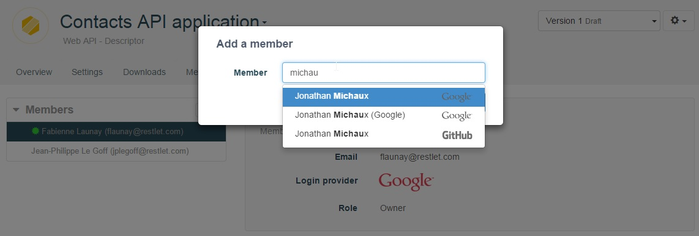
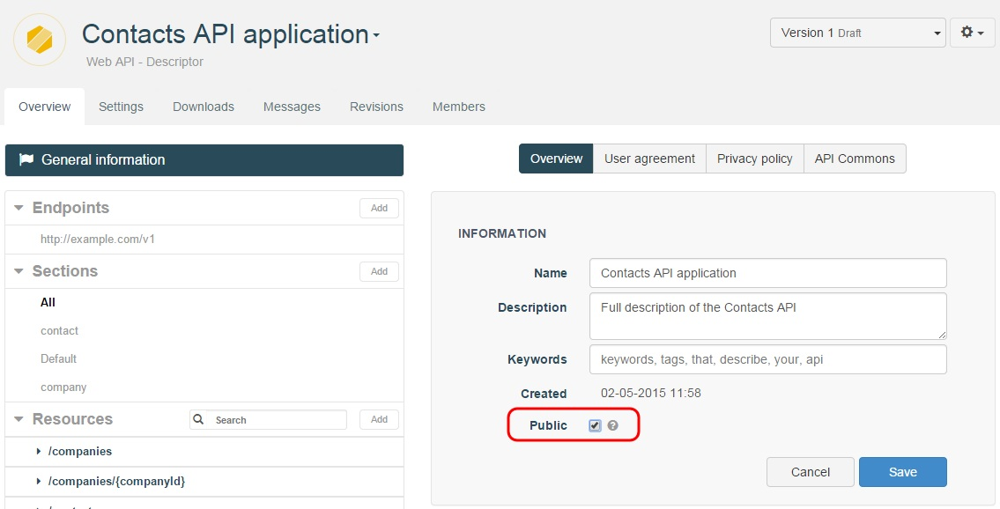
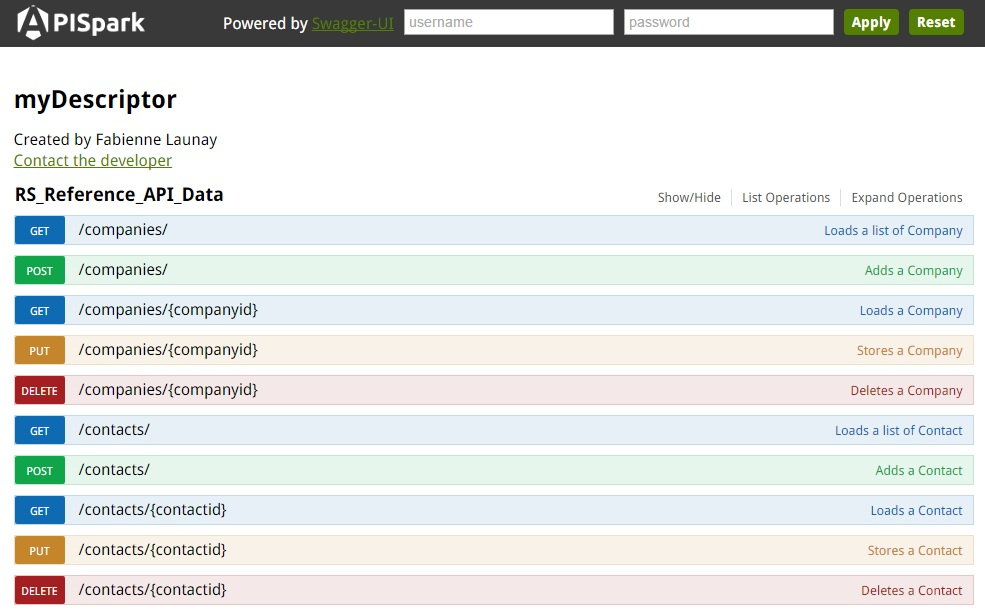

Once you have completed your **Descriptor** cell, you can get your web API documentation and share it with your team or make it public.

<!--
# Document your web API

For details on how to get the documentation of your cell, go to the [Documentation page](/technical-resources/apispark/guide/publish/publish/documentation "Documentation page") of the **Publish** section.
-->

# Share your web API Descriptor

## Share it with team members

Once you have created your Descriptor cell, you can share it with your team members.

Navigate to the **Members** tab, and click on the **Add** button.

For more information on Team work, jump to our [Team work](/technical-resources/apispark/guide/explore/team-work "Team work") section of the User Guide.

## Make it public

To share you Descriptor cell to anyone, you can also make it public.

Navigate to the **Overview** tab and select the **Public** checkbox.

# Download your Descriptor documentation

You can download your Descriptor documentation from the **Overview** tab. Select the appropriate Endpoint and click on the **swagger** button.  From the Swagger UI, you can either invoke your API or download its documentation locally.

# Use Standard formats for third party integration

With **APISpark**, you could download the [API definition in standard formats](/technical-resources/apispark/guide/publish/publish/api-definition "Standard API definition") like **RAML** or **Swagger** and integrate it with third party applications.
