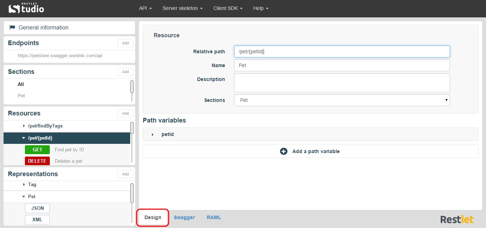

Restlet Studio provides a three-tab view of your API. You can craft your API from the **Design** tab and then have a look at the Swagger or RAML format generated in the **Swagger** and **RAML** tabs.

>**Note:** Swagger and RAML tabs are in Read-only mode. You can copy and paste the code generated if necessary. As you modify your API from the **Design** tab and the left column, you can see the changes in the **RAML** and **Swagger** tabs.

To visualize your API structure, browse through the different sections in the left panel: the content of each section displays in the **Design** tab of the central panel.

