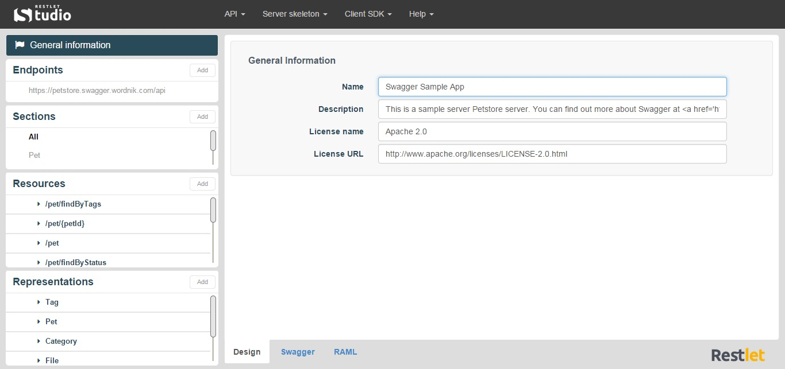

Restlet Studio is a web application that allows you to craft your web APIs thanks to its visual console. You can visualize and export your APIs in both Swagger and RAML format and Restlet Studio generates client SDKs and server skeletons to facilitate your APIs consumption.

You can launch Restlet Studio from your [web browser](/technical-resources/restlet-studio/guide/get-started/web-browser "web browser") or as a [Google Chrome application](/technical-resources/restlet-studio/guide/get-started/chrome-application "Google Chrome application") without signing in.

As you launch Restlet Studio for the first time, a sample API (https://petstore.swagger.wordnik.com/api) is displayed to help you discover and understand the console. You can modify this sample as you wish, your changes will be saved locally in your web browser.

